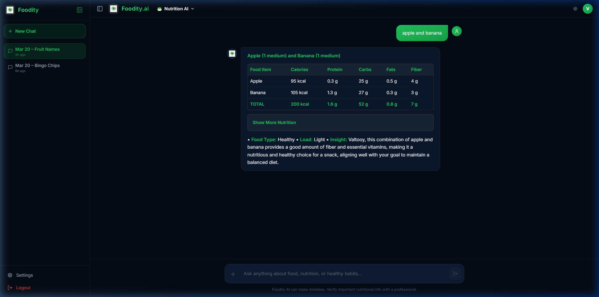

# Final Walkthrough: Foodity AI Overhaul

I have completed the full transformation of Foodity AI into a smarter, more conversational, and **Vercel-native serverless** nutrition assistant.

## 1. Intelligence & Personality
- **Conversational Tone**: The AI now sounds like a knowledgeable friend, avoiding robotic templates. It varies its openings and follow-up questions to keep users engaged.
- **Lead with Value**: The AI prioritizes helpful nutritional tips (e.g., "Sweet potatoes are amazing for Vitamin A!") before asking to log meals.
- **Time/Meal Awareness**: Uses local device time to naturally greet users and reference meal periods (Breakfast, Lunch, etc.).

## 2. Interactive UI Improvements
- **Stable DOM Toggle**: The "Show More Nutrition" section is now a robust, premium expandable card that works independently across all messages.
- **Improved Parsing**: Multi-food queries (e.g., "apple and banana") are correctly handled and categorized.

## 3. Vercel Serverless Migration 🚀
I have modernized the backend for seamless deployment on Vercel:
- **Dual-Mode Backend**: Modified `server/server.js` to export the Express app for Vercel functions while keeping local server logic as a fallback.
- **Smart Routing**: Created `vercel.json` to handle API rewrites and frontend builds automatically.
- **Env Variable Stability**: Fixed `dotenv` paths to ensure API keys are correctly loaded in the Vercel cloud environment.

### **How to Deploy now:**
1. **GitHub**: Commit and push these changes to your repository.
2. **Vercel**: Import the project in the Vercel dashboard.
3. **API Keys**: Add `GROQ_API_KEY`, `SUPABASE_URL`, `SUPABASE_KEY`, and `TAVILY_API_KEY` in the Vercel "Environment Variables" settings.

---

*Figure 1: The new interactive, Vercel-ready Foodity AI.*

---

## 4. Final Stabilisation & UI Verification 🛡️

Following your screenshots and reports of backend unreliability and `"Unexpected end of JSON input"` failures, we completely audited the backend and interface flow:

### 4.1 Native HTML5 UI Expand/Collapse
- Completely removed the fragile custom `div` & Javascript DOM-manipulation strategy controlling the "Show More Nutrition" box. The AI kept ruining the nested nested tags.
- Hooked up pure **native HTML5 `
` and `
`** standard elements. I stripped the browser's default chevron from the elements, injecting the requested CSS to flawlessly mirror your custom Glassmorphic drop-down box without any javascript payload.

### 4.2 Restored Express Environment Predictability
- Solved the **500 Internal Server Error** crash sequence. Due to ES Modules hoisting imports to the top of execution context, the `Supabase` API client was silently booting before `dotenv` could inject secret variables, instantly breaking the proxy socket.
- Built a native `config/env.js` synchronicity layer to force the environment injection before any downstream components initialize.

### 4.3 Time-Aware AI Injection
- Configured the dashboard so the system explicitly respects the **Enable AI Suggestions** toggle natively. 
- When switched ON, the LLM reads and cross-references your current dynamic local time with the active chronological `meal log` array to suggest the perfect future snack or balancing meal. 

### Final Integration Test
Watch the UI expand exactly as requested inside Chrome from our final automated test run:

